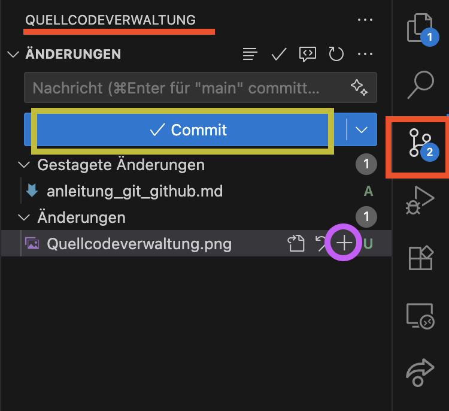

# Anleitung zu Git und Github

## Was ist Github

**GitHub** ist eine Website, auf der wir deine Git-Projekte online speichern und verwalten kannst.
Dort kannst wir mit anderen zusammenarbeiten, Änderungen vorschlagen oder Feedback geben.
Dein Code und deine Dateien liegen zentral und sind von überall erreichbar.

## Was ist Git

**Git** ist ein Programm, mit dem wir die Entwicklung unserer Dateien Schritt für Schritt mitverfolgen können.
Es merkt sich jede Änderung, die wir machen.
Wir können jederzeit zu einer älteren Version zurückspringen, wenn mal etwas schiefläuft.
Auch sehen wir genau, wer was geändert hat, wenn wir im Team arbeiten.
Das Beste: Alle können gleichzeitig arbeiten, ohne sich gegenseitig was zu zerschießen.
Ein Git-Projekt nennt man Repository – darin steckt alles, was zu unserem Projekt gehört.

## Grundbefehle bei Verwendung von Git wenn geänderter Code zu Github hochgeladen werden soll
* 1. Möglichkeit: Eingeben im Terminal bei VSCode (von Anne **nicht** empfohlen)

```zsh
git status       # zeigt an, was wir lokal geändert haben (können die anderen nicht sehen)
git add .        # fügt alle Änderungen zum nächsten Commit hinzu
git commit -m "Nachricht"  # speichert die Änderungen
git push         # lädt die Änderungen zu GitHub hoch
git pull         # aktualisiert den lokalen Stand mit möglichen Änderungen von den anderen (in Github)
```

* 2. Möglichkeit: Befehle im Source Control (Quellcodeverwaltung) von VSCode ausführen (von Anne empfohlen, weil einfacher):
    * (Quellcodeverwaltung: die 3 Kreise die mit Linien verbunden sind in der Seitenleiste)

- statt "git status": wird dort sowieso unter "Änderungen" angezeigt wenn sich was geändert hat (hinter den Dateien können Buchstaben stehen "U", "M", "D" interessiert uns nicht) (auch nicht sonderlich wichtig)
- statt "git add .": (geänderte) Dateien mit `+` hinter entsprechender Datei hinzufügen zum nächsten Commit (auch unter "Änderungen" zu finden)
- statt "git commit": Nachricht in Feld mit "Nachricht"/ "message" schreiben (grob was geändert wurde zB "updated readme" oder "added import packages" etc) und dann auf großen (blauen) Button "Commit" drücken 
- statt "git push": Button klicken "Sync changes" !!mit Pfeil nach oben!! 
- statt "git pull": wenn im großen (blauen) Button "Sync changes"/ "Änderung synchronisieren" mit Pfeil nach unten steht, drauf drücken; ansonsten hinter "ÄNDERUNGEN" auf 3 Punkte (...) dann auf "Pull"



### Ablauf 

Ausgangspunkt: Projekt klonen (von GitHub laden)  <- einmalig (kommt weiter unten)

1. Änderungen machen  
2. Änderungen committen (speichern)  
3. Änderungen pushen (hochladen)  
4. Andere holen sich die Änderungen per Pull  


## Installation Git

### für macOS:

1. Terminal öffnen
2. Prüfen, ob Homebrew installiert ist:
   ```zsh
   brew --version
   ```
    > Ich denke nicht das es bereits installiert ist aber zur Sicherheit

   Falls nicht vorhanden:
   ```zsh
   /bin/bash -c "$(curl -fsSL https://raw.githubusercontent.com/Homebrew/install/HEAD/install.sh)"
   ```
    Erwartete Ausgabe:
    Während der Installation werden verschiedene Schritte angezeigt, z. B. das Herunterladen von Dateien und das Einrichten von Homebrew.
    Am Ende der Installation erscheint eine wichtige Meldung, dass Homebrew in den PATH eingefügt werden muss, damit die Befehle im Terminal erkannt werden.
    Dafür werden zwei Befehle angezeigt, diese bitte kopieren und ihm Terminal ausführen damit alles klappt.

3. Git installieren:
   ```zsh
   brew install git
   ```
    > falls gesagt wird das brew nicht erkannt wurde kann es sein das die PATH Variable für das Terminal noch nicht aktualisiert ist, dann bitte das aktuelle Terminal schließen und ein neues Terminal öffnen, wenn das nicht hilft bitte Bescheid sagen

4. Version prüfen:
   ```zsh
   git --version
   ```

   Erwarte Ausgabe wenn es funktioniert hat: (Zahl kann variieren, 2.50.1 sollte aber das aktuellste sein)
   
   ```zsh 
   git version 2.50.1 
   ```

### für Windows:

1. Git herunterladen: https://git-scm.com/download/win  
2. Installer starten und durchklicken (Standardeinstellungen übernehmen)  
3. Als Editor **Visual Studio Code** auswählen
4. **WICHTIG** PATH-Option: Wähle die Einstellung „Git from the command line and also from 3rd-party software“, damit Git in allen Terminals (auch in VS Code) funktioniert.
5. Danach: Terminal in VS Code verwenden
6. Version prüfen:
    Version prüfen:
   ```zsh
   git --version
   ```

   Erwarte Ausgabe wenn es funktioniert hat: (Zahl kann variieren, 2.50.1 sollte aber das aktuellste sein) (Anmerkung Anne an Emma: solange da "git version" steht alles i.o., kann sein das nach der Zahl noch .windows o.ä. steht, auch ok)
   
   ```zsh 
   git version 2.50.1 
   ```


## Notwendiges Einrichten von Git für Mac & Windows

Git möchte lokal wissen, wer Änderungen macht. Diese Informationen (Name & E-Mail) werden in jedem Commit gespeichert, damit andere später sehen können, wer was gemacht hat.
Ihr könnt dieses zwei Werte über folgende zwei Befehle im VSCode Terminal setzen
```zsh
git config --global user.name <name>
git config --global user.email <email>
```
> **HINWEIS:** das muss nur einmal geschehen und kann jederzeit angepasst werden wenn notwendig

> **TIPP:** Ich würde euch raten(!) bei der email die einzusetzen die ihr für github benutzt habt, dann kann Github eure Commits eurem Account zuordnen

also bspw:
```zsh
git config --global user.name "Otto"
git config --global user.email "ottosEmailAufGithub@beispiel.de"
```

## Anfangsschritte für euer Projekt

### ssh Key erstellen

Damit wir ohne Passworteingabe mit GitHub kommunizieren können, brauchen wir einen SSH-Key.

#### für macOS und Windows:

1. Terminal in VSCode öffnen  
2. Befehl ausführen:
   ```zsh
   ssh-keygen -t ed25519 -C "Github" #In "" eintragen was man will, ist nur für uns persönlich Hinweis wofür Key ist
   ```
3. Enter drücken (Dateipfad bestätigen)  
4. Passphrase leer lassen (Enter drücken) oder vergeben  (nicht zwingend notwendig, Anne hat leer gelassen)

Bei Erfolg bekommen wir ein kleines Bild in die Konsole gemalt, z.B.:

```zsh
+--[ED25519 256]--+
|      o=o.       |
|     . O.*       |
|      o B.       |
|     . = =       |
|      . S .      |
|       o         |
|      E          |
|     o .         |
|    ..o.         |
+----[SHA256]-----+
```

### Key hinterlegen bei GitHub (Mac, Windows)

1. Öffne VSCode Terminal:
   ```zsh
   cat ~/.ssh/id_ed25519.pub
   ```
2. Schlüssel kopieren, einfach alles
3. Auf GitHub gehen: https://github.com/settings/keys  
4. „New SSH Key“ klicken  
5. Titel vergeben (z. B. „MacBook“) und Schlüssel einfügen, beim Einfügen deinen Kommentar (das was unter 2. bei Key Erstellen in "" steht) ganz hinten entfernen
6. Speichern  

## Klonen des Projekts per SSH

1. Auf GitHub auf Expra Repositorium gehen  
2. Auf (grünen) „Code“ Button über Ansicht der Dateien → „SSH“ auswählen → Link kopieren  
3. In VSCode Terminal:
    Ich gehe davon aus das wenn ihr das Terminal öffnet ihr im Standartpfad seid, dann reicht cd Desktop aus, um beim Desktop zu sein<br>
    (dann steht nach dem cd Befehl, Desktop als letztes Wort im Terminal)
    ```zsh
    cd Desktop # mit cd zu dem Überordner zb Desktop gehen damit der Ordner vom geklonten Repositorium da landet
    git clone <kopierten Link einfügen> <name des gewünschten Zielordners o. Ort wo es hin soll> # zb git clone <der link> Expra
    ```
    Beim ersten SSH-Verbindungsversuch zu GitHub erscheint eine Sicherheitsabfrage, um den Host-Schlüssel zu bestätigen.
    ```zsh
    The authenticity of host 'github.com (IP-Adresse)' can't be established.
    ED25519 key fingerprint is SHA256:XXXXXXXXXXXXXXXXXXXXXXXXXXXXXXXXXXXXXXXXXXX.
    Are you sure you want to continue connecting (yes/no/[fingerprint])?
    ```
    Das ist die Abfrage, ob wir das gerade erstelle ssh key Paar zum Authetifizieren verwenden wollen bzw. ob wir Githubs Teil des Keys akzeptieren. 
    Das können wir machen, also yes eingeben und Enter drücken. Das wird ab dann nicht mehr gefragt.

Danach wurde das Repositorium "heruntergeladen", sprich wir haben eine lokale Kopie davon. Dort können wir Änderungen machen und diese dann "hochladen"

## erster Commit und Push Beispiel (wie auch schon oben beschrieben)

1. Datei ändern/ bearbeiten, wenn fertig
2. In VS Code:
   - Source Control Tab öffnen
   - Datei mit `+` hinzufügen
   - Nachricht eingeben (z. B. `"Startprojekt"`)
   - Commit Button klicken
   - den selben Button nochmal drücken wo jetzt synchronisieren steht oder „…“ Menü → Push  
3. Oder im Terminal:
   ```zsh
   git status
   git add .
   git commit -m "Erster Commit"
   git push
   ```

## Hinweis zum ersten Pull
Wenn wir das erste mal einen Pull durchführen kommt von git meistens folgende Meldung;
```zsh
warning: Pulling without specifying how to reconcile divergent branches is
discouraged. You can squelch this message by running one of the following
commands sometime before your next pull:

  git config pull.rebase false  # merge (default)
  git config pull.rebase true   # rebase
  git config pull.ff only       # fast-forward only

You can replace "git config" with "git config --global" to set a default
preference for all repositories. You can also pass --rebase, --no-rebase,
or --ff-only on the command line to override the configured default per pull.

See https://git-scm.com/docs/git-pull for more information.
```

das ist nicht schlimm sondern normal.
Kopiert bitte denn ersten vorgeschlagenen Befehl, also:
```zsh
git config pull.rebase false 
```
gebt den im VSCode Terminal ein und drückt Enter, danach nochmal den Pull durchführen dann kommt diese Meldung nicht mehr.

### Bei weiteren Fragen gebt mir gerne Bescheid.